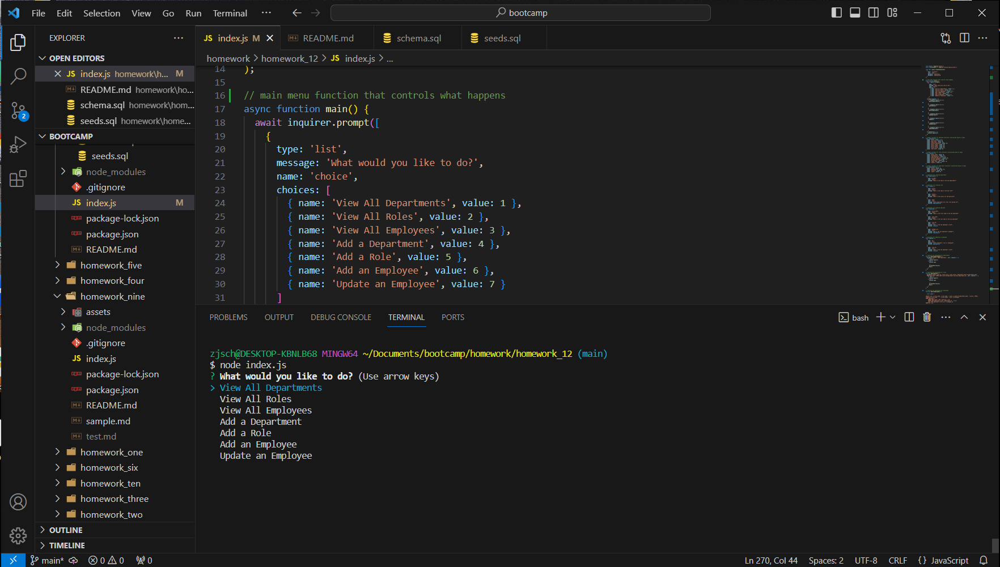

# In **Module 12 Challenge:** Employee Database

## Description

The goal of this project was to create an employee database that can be interacted with through the terminal using node and inquirer; the database itself uses MySQL. The user is able to view all departments, roles, and employees as well as add new departments, roles, and employees. Additionally, they may also update an employee's role. One of the main struggles of this project was making sure the syntax for the various moving parts were correct, as well as making sure the various functions interacted without issue. Unfortunately, while it may have been easier to read if there were two separate javascript files, in the interest of time, all functions are in one single file.

## Preview

The video linked here provides an example walkthrough of the code in action: [Employee Database run-through](https://drive.google.com/file/d/1OOhkOHi8S9GEkjLg61APljVaOXNP2nU3/view)

Provided here is a screenshot of the code upon initiating 'node index.js': 